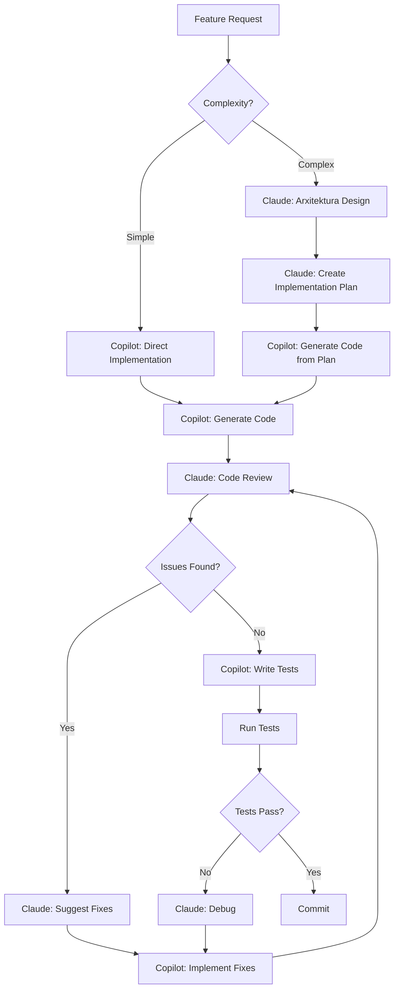
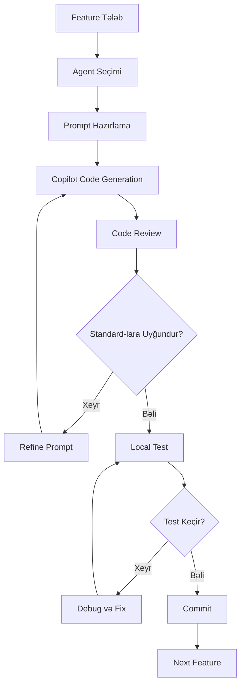

# LMS Sistemi - Fərdi Online Tədris İdarəetmə Platforması

Bu sənəd LMS (Learning Management System) sisteminin ətraflı planını təsvir edir. Sistem tək müəllim tərəfindən çoxlu sayda tələbənin **fərdi online tədris** formatında effektiv idarə edilməsi üçün optimallaşdırılıb.

## Tədris Formatı
- **Tədris növü**: Yalnız fərdi dərslər (1-1 format)
- **Tədris forması**: Online (video konfrans vasitəsilə) - Google Meet 
- **Dərs qiyməti**: 25 AZN/dərs (sabit tarif)
- **Ödəniş seçimləri**: 
  - Aylıq ödəniş (qabaqcadan ödəniş)
  - Hər dərs bitimində ödəniş (pay-as-you-go)

## Əsas Xüsusiyyətlər

### 1. İstifadəçilər

#### **Müəllim** (Admin + Müəllim Funksiyaları)
- Tam sistem nəzarəti və idarəetmə hüquqları
- Bütün tələbələrin məlumatlarına tam giriş
- Kurslar, dərslər, materiallar və qiymətləndirmələr üzərində tam nəzarət
- Daxili dəstək sistemi vasitəsilə tələbə suallarına cavab verə bilər
- Ödəniş və maliyyə izləmə sistemini idarə edə bilər
- Fərdi dərs cədvəlini və təyinatları idarə edə bilər
- Online dərs keçirilməsi üçün video konfrans linkləri yaradır
- Hər dərsin qeydini (recording) saxlaya və tələbələrlə paylaşa bilər

#### **Tələbə** 
- Kurslara qeydiyyatdan keçə bilər
- Qeydiyyat zamanı ödəniş metodunu seçir (aylıq və ya dərs əsaslı)
- **Fərdi GitHub repository-ə giriş** (qeydiyyatdan sonra avtomatik yaradılır)
- Fərdi online dərsləri izləyə və materialları görə bilər
- **YouTube linkləri vasitəsilə dərs videolarını izləyə bilər**
- GitHub repo-sundan dərs materiallarını yükləyə bilər
- Qiymətləndirmə nəticələrini görə bilər
- Fərdi dərs təyinatı edə bilər (Calendly tipli sistem)
- Video konfrans linklərindən dərsə qoşula bilər
- Keçmiş dərslərin qeydlərini (recording) izləyə bilər
- Daxili dəstək sistemi vasitəsilə müəllimə sual verə bilər
- Ödəniş statusunu və dərs balansını görə bilər
- Hər dərsin qiymətini (25 AZN) və ümumi xərcləri izləyə bilər

##### Qeydiyyat və Təsdiqlənmə Prosesi
1. **Tələbə Qeydiyyat Formu**:
   - Şəxsi məlumatlar (ad, soyad, email, telefon)
   - Kurs seçimi
   - Həftəlik dərs miqdarı seçimi (1-7 dərs/həftə)
   - Təhsil səviyyəsi və məqsədlər
   - **Ödəniş modeli seçimi** (vacib!):
     * **Aylıq ödəniş**: Hər ayın əvvəlində həftəlik dərs sayı x 4 x 25 AZN ödənilir
     * **Dərs əsaslı ödəniş**: Hər dərsdən sonra 25 AZN ödənilir
   - Üstünlük verilən dərs saatları və günləri
   - Vaxt zonası məlumatı
   
2. **Müəllim Təsdiqlənməsi**:
   - Qeydiyyat sorğularının siyahısı
   - Tələbənin profil məlumatlarının yoxlanması
   - Təsdiqlənmə və ya rədd etmə seçimi
   - **Avtomatik GitHub Repository yaradılması**:
     * Tələbənin ad-soyadına əsasən repo adı generasiyası
     * Private repository yaradılması (müəllim və tələbə giriş hüququ)
     * README.md faylının avtomatik yaradılması (tələbə məlumatları ilə)
     * Əsas qovluq strukturunun yaradılması (lessons/, projects/, resources/)
     * Tələbəyə repo linkinin və giriş təlimatlarının göndərilməsi
   - Avtomatik email göndərilməsi (giriş məlumatları, GitHub repo linki, ilk dərs təyinatı)
   - Tələbə üçün fərdi dərs planının hazırlanması

### 2. Kurs və Dərs İdarəetməsi

#### Kurs Yaradılması və İdarəsi
- **Kurs profili**: Ad, təsvir, kateqoriya, qiymət, müddət, səviyyə
- **Kurs şəkilləri və tanıtım videoları**: Vizual materialların yüklənməsi
- **Kursun məqsədləri və nəticələri**: Tələbələrin nə öyrənəcəyinin təsviri
- **Ön şərtlər**: Kurs üçün tələb olunan bilik səviyyəsi
- **Kurs statusu**: Aktiv, Arxiv, Hazırlanır

#### Dərs İdarəetməsi (Material Management)
- **Dərs yaradılması**: Başlıq, təsvir, məqsədlər, müddət
- **Müxtəlif material formatları**:
  - **Video dərslər** (YouTube linkləri ilə):
    * YouTube video linkinin daxil edilməsi
    * Avtomatik video məlumatlarının çəkilməsi (başlıq, müddət, thumbnail)
    * Video izləmə statistikası
    * Playlist dəstəyi (ardıcıl dərslər üçün)
    * Embedded player (tələbə platformadan çıxmadan izləyə bilər)
  - PDF sənədlər və təqdimatlar
  - Mətn əsaslı dərslər (rich text editor)
  - Kod nümunələri (syntax highlighting ilə)
  - Təcrübə tapşırıqları və layihələr
  - Xarici resurs linkləri
  
- **Materialların asanlıqla idarəsi**:
  - Drag & drop ilə sıralama
  - Kütləvi yükləmə (bulk upload)
  - Material şablonları
  - Surət çıxarma və təkrar istifadə
  - Versiya idarəetməsi (material tarixi)
  - Materialların arxivləşdirilməsi
  - **GitHub inteqrasiyası**:
    * Yeni material əlavə edildikdə avtomatik GitHub-a commit
    * Hər tələbənin repo-suna fərdi materialların göndərilməsi
    * YouTube video linklərinin README-də siyahılanması
    * Dərs qeydləri və əlavə resursların strukturlaşdırılmış şəkildə saxlanması
    * Commit mesajları ilə dəyişiklik tarixinin izlənməsi
  
- **Dərs strukturu**:
  - Bölmələr və alt-bölmələr
  - Ardıcıllıq və asılılıqlar (prerequisite lessons)
  - Tamamlanma şərtləri

#### Kurs Kateqoriyaları və Təşkili
- Çox səviyyəli kateqoriya strukturu
- Tag sistemi (flexible kategoriyalaşdırma)
- Kursların filtrlənməsi və axtarışı
- Kurslararası əlaqələndirmə

### 3. Tələbə İdarəetmə Sistemi

#### Tələbə Profil İdarəsi
- **Ətraflı profil məlumatları**:
  - Şəxsi məlumatlar (foto, ad, soyad, təvəllüd, email, telefon)
  - **GitHub Repository məlumatları**:
    * Avtomatik yaradılmış repo linki
    * Repository adı (format: studentname-coursename)
    * Repo statusu (aktiv, arxivləşdirilmiş)
    * Son commit tarixi
    * Tələbənin GitHub istifadəçi adı (əgər varsa)
  - Təhsil və karyera məlumatları
  - Təhsil məqsədləri və maraqları
  - Dil bilikləri və texniki səviyyə
  - Fərdi qeydlər (yalnız müəllim görür)
  
- **Tələbə statusu**:
  - Aktiv, Passiv, Dondurulmuş, Bitirmiş
  - Status dəyişikliyi tarixi
  - Səbəb və qeydlər

#### Tələbə Siyahısı və Filtrasiya
- **Güclü filtrleme sistemi**:
  - Kurs, status, qeydiyyat tarixi
  - Ödəniş statusu, borc vəziyyəti
  - İrəliləyiş səviyyəsi, performans
  - Xüsusi etiketlər
  
- **Kütləvi əməliyyatlar**:
  - Seçilmiş tələbələrə mesaj göndərmə
  - Status dəyişikliyi
  - Material paylaşımı
  - Excel/CSV export

#### İrəliləyiş İzləmə (Progress Tracking)
- **Ümumi irəliləyiş**:
  - Tamamlanan dərslər faizi
  - Xərclənən vaxt statistikası
  - Son aktivlik tarixi
  - Kursa qoşulma tarixi
  
- **Detallı analitika**:
  - Dərslərə iştirak xəritəsi (heatmap)
  - Video izləmə statistikası
  - Tapşırıq tamamlanma nisbəti
  - Test nəticələri trendinq
  - Zəif və güclü tərəflərin təhlili
  
- **Davamiyyət izləmə**:
  - Canlı dərslərə iştirak
  - Gecikmə və qayıb dərslər
  - İştirak qrafiki və statistika
  - Xəbərdarlıq sistemləri (az iştirak halında)

### 4. Fərdi Dərs Təyinatı Sistemi (Calendly Tipli)

#### Müəllim Üçün
- **Əlçatan vaxt təyini**:
  - Həftəlik qrafik (günlər və saatlar)
  - Xüsusi tarixlər üçün mövcudluq/qeyri-mövcudluq
  - Buffer vaxtlar (dərslər arası fasilə - minimum 10-15 dəqiqə)
  - Maksimum gündəlik dərs limiti
  - Fasilə vaxtları (nahar, istirahət)
  
- **Dərs növləri və parametrlər** (hamısı 1-1 fərdi format):
  - Standart dərs (əsas kurs dərsi) - 25 AZN
  - Sınaq dərsi (trial lesson) - pulsuz və ya endirimli
  - Məsləhət görüşü (consultation) - 25 AZN
  - Təkrar dərs (review session) - 25 AZN
  - Dərs müddətləri (60/90 dəqiqə - standart 60 dəq)
  
- **Təyinat idarəsi**:
  - Təyinatların təsdiq/rədd etmə sistemi (opsional)
  - Avtomatik təsdiqlənmə (əgər slot mövcudsa)
  - Avtomatik video konfrans link generasiyası (Zoom/Google Meet)
  - Təyinatları yenidən planlaşdırma
  - Ləğvetmə qaydaları (minimum 24 saat əvvəl)
  - Təxirə salma tələbləri
  - Dərs qeydi (recording) aktivləşdirmə seçimi

#### Tələbə Üçün
- **Sadə təyinat prosesi**:
  - Real-time mövcud saatların görünməsi
  - Kalendarya baxış (gün/həftə/ay)
  - Vaxt zonası avtomatik uyğunlaşdırma
  - Sürətli təyinat (bir kliklə)
  - Dərs balansının görünməsi (aylıq və ya dərs sayı)
  
- **Təyinat detalları**:
  - Dərs növü və öyrənmək istədiyi mövzu seçimi
  - Opsional qeydlər (suallar, hazırlıq məlumatları)
  - Avtomatik video konfrans link alınması
  - Dərsdən əvvəl material yüklənməsi (əgər varsa)
  - Dərs qiymətinin görünməsi (25 AZN)
  
- **Xatırlatma sistemi**:
  - Email xatırlatmaları (24 saat və 1 saat əvvəl)
  - SMS xatırlatmaları (opsional)
  - In-app bildirişlər
  
- **Yenidən planlaşdırma və ləğvetmə**:
  - Təyinatın dəyişdirilməsi (minimal müddətə riayət etməklə)
  - Ləğvetmə (qaydalar çərçivəsində)
  - Tarixi təyinatlar

#### İnteqrasiya və Online Dərs Xüsusiyyətləri
- **Kalendarya sinxronizasiya**:
  - Google Calendar avtomatik sinxronizasiya
  - iCal/Outlook calendar export
  - Real-time slot yenilənməsi
  
- **Video konfrans inteqrasiyası**:
  - Zoom API ilə avtomatik meeting yaradılması
  - Google Meet link generasiyası
  - Hər dərs üçün unikal link
  - Waiting room aktivləşdirmə
  - Avtomatik recording başladılması
  
- **Dərs qeydləri (Recording)**:
  - Avtomatik cloud saxlama
  - Tələbə ilə avtomatik paylaşım
  - İzləmə statistikası
  - Müddətsiz saxlanma və ya avtomatik silinmə seçimi

### 5. Daxili Dəstək Sistemi (Support Ticket System)

#### Tələbə Üçün
- **Sual göndərmə**:
  - Sual formu (başlıq, kateqoriya, prioritet, təsvir)
  - File əlavələri (screenshot, sənəd və s.)
  - Kursa və dərsə istinad
  - Kod parçaları üçün xüsusi format
  
- **Sual kateqoriyaları**:
  - Texniki problem
  - Dərs materialı ilə bağlı sual
  - Tapşırıq köməyi
  - Ödəniş məsələsi
  - Dərs təyinatı
  - Ümumi sual
  
- **Ticket izləmə**:
  - Statuslar: Yeni, Baxılır, Cavablandı, Həll edildi, Bağlandı
  - Real-time bildirişlər
  - Ticket tarixi və mesaj axını
  - Bağlılıq dərəcəsi (Normal, Vacib, Təcili)

#### Müəllim Üçün
- **Ticket Dashboard**:
  - Bütün ticketlərin siyahısı
  - Filtrlər (status, kateqoriya, tələbə, tarix, prioritet)
  - Cavab gözləyən ticketlər
  - Ən çox sual verilən mövzular
  
- **Cavab sistemi**:
  - Rich text editor (formatlaşdırma, kod, link)
  - File paylaşımı
  - Video cavablar (loom tipli)
  - Hazır cavab şablonları (FAQ)
  - Digər dərs materiallarına link
  
- **Ticket idarəsi**:
  - Status dəyişikliyi
  - Prioritet təyini
  - Kateqoriya təyin etmə
  - İç qeydlər (tələbə görməz)
  - Ticket birləşdirmə və ya bölmə
  - Avtomatik yönləndirmə qaydaları
  
- **Bildiriş parametrləri**:
  - Yeni ticket bildirişi
  - Tələbə cavabı bildirişi
  - Email digest (günlük özət)
  - Təcili ticketlər üçün SMS (opsional)

#### Əlavə Xüsusiyyətlər
- **FAQ Bazası**:
  - Ticketlərdən FAQ yaratma
  - FAQ axtarış sistemi
  - Tələbələr üçün self-service
  
- **Analitika**:
  - Orta cavab müddəti
  - Həll edilmə müddəti
  - Ən çox soruşulan suallar
  - Tələbə məmnuniyyəti reytinqi
### 6. Qiymətləndirmə və Geri Dönüş Sistemi

#### Test və Quiz Sistemi
- **Müxtəlif sual növləri**:
  - Çoxseçimli suallar (single/multiple choice)
  - Doğru/Yanlış
  - Qısa cavab
  - Uzun cavab (essay)
  - Kod yazma (code editor ilə)
  - Fayl yükləmə (layihə təqdimləri)
  - Uyğunlaşdırma (matching)
  - Sıralama
  
- **Test parametrləri**:
  - Vaxt limiti
  - Keçid balı
  - Cəhd sayı
  - Sualların qarışdırılması
  - Dərhal nəticə göstərmə/gizlətmə
  - Doğru cavabları göstərmə seçimi
  
- **Avtomatik qiymətləndirmə**:
  - Çoxseçimli və qısa cavabların avtomatik yoxlanılması
  - Manual yoxlama tələb edən sualların ayrılması
  - Qismən bal verme imkanı
  
#### Tələbə Qiymətləndirmə Sistemi
- **Fərdi qiymətləndirmə**:
  - Test nəticələri
  - Tapşırıq qiymətləndirməsi
  - Layihə qiymətləndirməsi
  - İştirak və davamiyyət balı
  - Ümumi performans balı
  
- **Qiymətləndirmə kriteriyaları**:
  - Rubrik sistemi (detallı baxış)
  - Bal skalaları
  - Keyfiyyət göstəriciləri
  - Proqressiv qiymətləndirmə
  
- **Rəqəmsal sertifikatlar**:
  - Kurs tamamlama sertifikatı
  - Nailiyyət nişanları (badges)
  - Uğur sertifikatları
  - PDF və ya rəqəmsal format

#### Geri Dönüş və Feedback Sistemi
- **Müəllim tərəfindən geri bildirim**:
  - Ümumi kurs feedback
  - Dərs səviyyəsində rəy
  - Tapşırıq və test üzrə detallı şərh
  - Video feedback (loom tipli)
  - Audio feedback
  - Annotasiya olunmuş fayl qaytarma
  
- **Feedback şablonları**:
  - Tez-tez istifadə olunan rəylər
  - Konstruktiv tənqid şablonları
  - Təşvik edici mesajlar
  - Təkmilləşdirmə tövsiyələri
  
- **Tələbə tərəfindən geri bildirim**:
  - Dərs reytinqi
  - Kurs qiymətləndirməsi
  - Müəllim feedback
  - Təkmilləşdirmə təklifləri
  
- **Geri dönüş izləmə (Follow-up)**:
  - Əsas məqamların izlənməsi
  - Təkmilləşdirmə tövsiyələrinin yoxlanılması
  - Proqress yoxlamaları (check-in sessions)
  - Fərdi inkişaf planı

### 7. Ödəniş İdarəetmə Sistemi (Fərdi Tədris üçün)

#### Ödəniş Strukturu (Sabit: 25 AZN/dərs)
- **İki əsas ödəniş modeli**:
  
  **Model 1: Aylıq Ödəniş (Abunə sistemi)**
  - Tələbə qeydiyyat zamanı həftəlik dərs sayını seçir (məs: 2 dərs/həftə)
  - Aylıq məbləğ: (həftəlik dərs sayı × 4) × 25 AZN
  - Nümunə: 2 dərs/həftə = 8 dərs/ay = 200 AZN/ay
  - Hər ayın 1-də avtomatik ödəniş çıxılır
  - Əvvəlcədən ödənilir (prepaid)
  - 5-10% endirim tətbiq oluna bilər
  
  **Model 2: Dərs əsaslı ödəniş (Pay-as-you-go)**
  - Hər dərs bitdikdən sonra 25 AZN ödənilir
  - Dərs qurtardıqdan sonra 24 saat ərzində ödəniş edilməlidir
  - Növbəti dərs təyinatı üçün əvvəlki dərsin ödənilməsi tələb olunur
  - Daha çevik, lakin aylıq modeldən bir qədər bahadır
  
- **Əlavə xüsusiyyətlər**:
  - Sınaq dərsi (trial) - pulsuz və ya 50% endirimli (12.5 AZN)
  - Uzunmüddətli paketlər (3 aylıq, 6 aylıq) - əlavə 10-15% endirim
  - Referral bonusu - hər tövsiyə üçün 1 pulsuz dərs
  - Promosyon kodları sistemi

#### Ödəniş Metodları
- **İnteqrasiyalar**:
  - Kredit/Debit kart (Stripe, PayPal)
  - Bank köçürməsi
  - Nağd ödəniş
  - Kripto ödəniş (opsional)
  - Lokal ödəniş sistemləri
  
- **Avtomatik ödəniş**:
  - Təkrarlanan ödənişlər (recurring)
  - Avtomatik faktura yaradılması
  - Ödəniş xatırlatmaları

#### Ödəniş İzləmə və Təşkili
- **Tələbə ödəniş profili**:
  - Seçilmiş ödəniş modeli (aylıq və ya dərs əsaslı)
  - Ödəniş tarixi (keçmiş bütün ödənişlər)
  - Gələcək ödənişlər (aylıq model üçün)
  - Dərs balansı:
    * Aylıq model: bu ay qalan dərs sayı
    * Dərs əsaslı model: ödənilməmiş dərs sayı
  - Ümumi xərclər və statistika
  - Endirim və bonuslar (referral, paket endirimi)
  - Faktura və qəbzlər (hər ödəniş üçün)
  - Dərs başına xərc hesablaması
  
- **Maliyyə Dashboard (Müəllim)**:
  - Gündəlik/Həftəlik/Aylıq gəlir (25 AZN × dərs sayı)
  - Model üzrə breakdown:
    * Aylıq abunədən gəlir
    * Dərs əsaslı ödənişdən gəlir
  - Gözlənilən ödənişlər (aylıq modelə görə)
  - Gecikmiş ödənişlər (dərs əsaslı model üçün)
  - Keçirilən dərs sayı və gəlir nisbəti
  - Tələbə başına orta gəlir (aylıq/illik)
  - Doldurulma nisbəti (booked vs available slots)
  - Gəlir trendinqləri və proqnozlar
  - Model müqayisəsi (hansı model daha çox istifadə olunur)
  
- **Ödəniş statusları**:
  - **Aylıq model üçün**:
    * Ödənilib (ay aktiv)
    * Gözləmədə (növbəti ay ödənişi)
    * Gecikmiş (ay sonuna 5 gün qaldıqda xatirlatma)
    * Dondurulmuş (abunə dayandirilmis)
  - **Dərs əsaslı model üçün**:
    * Ödənilib (dərsdən sonra 24 saat ərzində)
    * Gözləmədə (dərs bitib, 24 saat keçməyib)
    * Gecikmiş (24 saatdan çox keçib)
    * Qismən ödənilib (seçilmişsə)
  - Ləğv edilib
  - Geri qaytarılıb

#### Faktura və Sənəd İdarəsi
- **Avtomatik faktura**:
  - Faktura yaradılması və nömrələndirilməsi
  - Xüsusi branding (logo, məlumatlar)
  - PDF format
  - Email ilə avtomatik göndərilmə
  
- **Qəbz və çek**:
  - Ödəniş qəbzi
  - Kurs tamamlama sertifikatı ilə birlikdə
  - Vergi məlumatları (əgər tələb olunarsa)
  
- **Maliyyə hesabatları**:
  - Aylıq gəlir hesabatı
  - İllik maliyyə özəti
  - Vergi hesabatları
  - Excel/PDF export

#### Borc İdarəsi və Xatırlatmalar
- **Avtomatik xatırlatma sistemi**:
  
  **Aylıq ödəniş modeli üçün**:
  - Ay başlamazdan 3 gün əvvəl xatirlatma
  - Ayın 1-də ödəniş tələbi
  - Ödəniş edilməzsə: 2, 5, 7 gün sonra xatırlatma
  - 10 gün gecikmədə xidmət dayandirilmasi xatirlatmasi
  
  **Dərs əsaslı ödəniş modeli üçün**:
  - Dərs bitdikdən dərhal ödəniş linki göndərilməsi
  - 12 saat sonra xatirlatma (0-12 saat aralig)
  - 24 saat tam olduqda son xatirlatma
  - 24 saatdan sonra gecikmis statusu və növbəti dərs bloklama
  
- **Borc idarəsi**:
  - Aylıq model: 10 gündən çox gecikmə - xidmət dayandirma
  - Dərs əsaslı: Ödəniş edilməyən dərslər üçün növbəti təyinat qadagan
  - 2+ dərs borc: avtomatik əlaqə və ödəniş planı
  - Gecikdirilmiş ödəniş planları (fərdi razilaşma)
  - Xidmət bərpa qaydaları

### 8. Hesabat və Analitika Sistemi

#### Kurs Hesabatları
- Qeydiyyat sayı və trendinglər
- Tamamlanma nisbəti
- Orta tamamlanma müddəti
- Tələbə məmnuniyyəti reytinqi
- Ən çox baxılan dərslər
- Ən çətin dərslər (çox vaxt tələb edən)
- Video izləmə statistikası

#### Tələbə Hesabatları
- **Fərdi performans**:
  - Ümumi proqress
  - Test nəticələri
  - Tapşırıq tamamlanması
  - Davamiyyət statistikası
  - Xərclənən vaxt
  - Güclü və zəif tərəflər
  
- **Müqayisəli analiz**:
  - Qrup ortalaması ilə müqayisə
  - Tələbələrarası reytinq
  - İrəliləyiş sürəti analizi

#### Biznes Hesabatları
- **Maliyyə analitikası**:
  - Aylıq gəlir (dərs sayı × 25 AZN)
  - Gəlir mənbələri breakdown (aylıq vs dərs əsaslı)
  - Ödəniş uğur nisbəti (hər iki model üçün)
  - Müştəri ömr dəyəri (CLV) - orta tələbə nə qədər qalir
  - Orta tələbə başına gəlir (aylıq/illik)
  - Model üzrə müqayisə (hansı daha səmərəli)
  - Dərs başına real gəlir (endirimlərlə birlikdə)
  
- **Tələbə analitikasi**:
  - Aktiv tələbə sayı (hər iki modeldə)
  - Yeni qeydiyyatlar
  - Model seçimi statistikasi (neçə tələbə hansı modeli seçir)
  - Churn rate (itki nisbəti)
  - Retention rate (saxlama nisbəti - modellər üzrə)
  - Tələbə əldə etmə kanalları
  - Orta tələbə ömrü (aylarla)
  
- **Vaxt idarəsi (Fərdi Online Dərslər)**:
  - Həftəlik/Aylıq keçirilmiş dərs sayı
  - Doldurulma nisbəti (booked vs available time slots)
  - Ən məhsuldar dərs saatlari və günləri
  - Ləğv edilmiş/yenidən planlaşdirilmiş dərslər
  - Online dərs platforması uptime (Zoom/Meet)
  - Orta dərs müddəti və övərtıme

#### Exportlar və Təqdimat
- Excel/CSV export
- PDF hesabatlar
- Qrafik və chart generasiyası
- Email ilə planlı hesabatlar
- Dashboard screenshot paylaşımı

### 9. Bildiriş və Kommunikasiya Sistemi

#### Email Sistemi
- **Avtomatik emaillər**:
  - Qeydiyyat təsdiqləmə
  - Dərs xatırlatmaları
  - Ödəniş bildirişləri
  - Yeni material əlavələri
  - Test və tapşırıq nəticələri
  - Sertifikat göndərişi
  
- **Manual emaillər**:
  - Fərdi tələbəyə mesaj
  - Qrup mesajı (bulk email)
  - Xüsusi elanlar
  - Email şablonları

#### In-App Bildirişlər
- Real-time bildirişlər
- Push notifications (browser/mobile)
- Bildiriş mərkəzi (notification center)
- Oxunmuş/oxunmamış statusu
- Bildiriş parametrləri (istifadəçi tərəfindən)

#### Mesajlaşma Sistemi
- Müəllim-Tələbə 1-1 mesajlaşma
- Attachment dəstəyi
- Mesaj axtarışı
- Mesaj arxivi
- Unread mesaj sayı

### 10. Dashboard və İstifadəçi İnterfeysi

#### Müəllim Dashboard
- **Ana səhifə widget-ləri**:
  - Bugünkü dərslər və təyinatlar
  - Yeni ticketlər və mesajlar
  - Tamamlanmamış qiymətləndirmələr
  - Ödəniş xatırlatmaları
  - Tələbə aktivlik feed
  - Sürətli statistika kartları
  
- **Tez əlçatan funksiyalar**:
  - Dərs əlavə et
  - Yeni material yüklə
  - Bildiriş göndər
  - Hesabat gör
  - Tələbə axtar

#### Tələbə Dashboard
- **Ana səhifə**:
  - Növbəti dərs təyinatı
  - Proqress göstəricisi
  - Yeni materiallar
  - Yoxlanmamış tapşırıqlar
  - Son nəticələr
  - Bildirişlər
  
- **Sürətli keçidlər**:
  - Kurslarım
  - Dərs təyin et
  - Sual göndər
  - Ödənişlərim

### 11. Təhlükəsizlik və Məlumat Qorunması

#### İstifadəçi Autentifikasiyası
- Email və şifrə
- İki faktorlu autentifikasiya (2FA)
- Social login (Google, Facebook - opsional)
- Password reset sistemi
- Session idarəsi

#### Məlumat Təhlükəsizliyi
- SSL/TLS şifrələmə
- Məlumat bazası şifrələmə
- GDPR uyğunluq
- Backup və recovery sistemi
- Audit log (sistem dəyişiklikləri)
- İstifadəçi məlumatlarının silinməsi (right to be forgotten)

#### Rol və İcazələr
- Müəllim (tam giriş)
- Tələbə (məhdud giriş)
- İcazə səviyyələri
- IP whitelist (opsional)

## Texniki Tələblər və Arxitektura

### 🏗️ Django Fullstack Monolithic Arxitektura - DigitalOcean / Railway üçün Optimal

Bu LMS sistemi üçün **Django Fullstack (Monolithic)** arxitekturası optimal həll təqdim edir çünki:
- Tək framework (Django) - backend + frontend birlikdə
- Django Templates ilə SSR (Server-Side Rendering)
- Microservices-dən daha sadə deployment və maintenance
- Django Admin paneli built-in (CMS kimi)
- Lazım gələrsə modullları Django REST Framework ilə API-ya çevirmək asandır
- Tək müəllim üçün infrastruktur xərcləri minimaldır
- **DigitalOcean App Platform** və **Railway** üçün optimaldır

### 🚀 Deployment Strategiyası

**Deployment Platformları:**

**1️⃣ DigitalOcean App Platform (Tövsiyə)**
- **Native GitHub Integration** - Push-to-deploy
- **Python Runtime Support** - Native Django dəstəyi
- **Automatic Scaling** - Traffic əsasında
- **Built-in CDN** - Static files və media üçün
- **Cost-Effective** - $12-28/ay (Django + PostgreSQL)
- **Managed Databases** - PostgreSQL, Redis
- **Zero DevOps** - Infrastructure management avtomatik
- **SSL Certificates** - Pulsuz və avtomatik
- **App-level Monitoring** - Built-in metrics

**2️⃣ Railway.app (Alternativ)**
- Developer-friendly UI
- Simple deployment (railway up)
- $5/ay başlanğıc
- PostgreSQL + Redis included
- Automatic HTTPS

---

### 🚀 Backend Tech Stack (Django Fullstack)

#### **Core Framework: Django 5.0+ (Python)**
**Niyə Django? (DigitalOcean / Railway üçün ideal)**
- **Batteries Included** - Hər şey built-in (ORM, Admin, Auth, Forms)
- **Python 3.11+** - Modern, fast, type hints dəstəyi
- **Django REST Framework** - Güçlü API framework (lazım gələrsə)
- **Django Templates** - SSR (Server-Side Rendering)
- **DigitalOcean native dəstəyi** - Python runtime built-in
- **Deployment simplicity** - Gunicorn + Nginx
- **Batteries included admin** - CMS kimi istifadə edilə bilər
- **Resource-efficient** - Python memory footprint aşağıdır
- **Async support** - Django 5.0+ async views və ORM

**DigitalOcean üçün optimal konfiqurasiya:**
- Python 3.11+ (built-in runtime)
- Package manager: pip + requirements.txt
- Production server: Gunicorn + Whitenoise
- Health check endpoint: /health/
- Static files: Whitenoise (CDN alternative)

#### **Database & ORM**
- **Primary Database**: **DigitalOcean Managed PostgreSQL 15+**
  - **Native App Platform inteqrasiyası** (connection pooling built-in)
  - Automatic backups (daily)
  - Automatic failover
  - Relational data üçün ideal
  - JSON support (JSONField - flexible məlumat saxlama)
  - **Connection string environment variable** (auto-injected)
  - **Cost**: $15/ay başlanğıc (1GB RAM, 10GB storage)
  - **Alternativ**: Railway PostgreSQL (free tier 500MB)
  
- **ORM**: **Django ORM**
  - **Built-in** - Əlavə dependency yoxdur
  - **Powerful** - Complex queries, aggregations, transactions
  - **Migration system** - Automatic schema management
  - **QuerySet API** - Lazy evaluation, chainable
  - **Type hints support** - Python 3.11+ type safety
  - **Database-agnostic** - PostgreSQL, MySQL, SQLite, Oracle
  - **DigitalOcean DATABASE_URL** ilə işləyir (dj-database-url)
  - **Connection pooling** - django-db-geventpool

#### **Caching & Session**
- **DigitalOcean Managed Redis 7+**
  - **Native App Platform inteqrasiyası**
  - Session management
  - Cache layer (frequently accessed data)
  - Rate limiting
  - Real-time features üçün pub/sub
  - Bull Queue üçün storage
  - **Automatic connection** (environment variables)
  - **Cost**: $15/ay başlanğıc (1GB RAM)
  - **Alternativ**: Upstash Redis (serverless, $0.20/100K commands)

#### **Queue System**
- **Bull / BullMQ**
  - Background jobs (email göndərmə, GitHub commits)
  - Scheduled tasks (ödəniş xatırlatmaları)
  - Retry mechanism
  - Job prioritization
  - Redis-based

#### **File Storage**
- **DigitalOcean Spaces (S3-compatible)**
  - **Built-in CDN** (global delivery)
  - S3 API-compatible (AWS SDK işləyir)
  - Dərs materialları
  - Profile şəkilləri
  - Generated documents (faktura, sertifikat)
  - Video recordings (large files)
  - **Cost**: $5/ay (250GB storage + 1TB transfer)
  - **Alternativ**: Cloudinary (image optimization üçün)

#### **Real-time Communication**
- **Django Channels**
  - Real-time notifications
  - WebSocket support
  - Live updates
  - Chat/messaging

---

### 🎨 Frontend Tech Stack (Django Templates)

#### **Template Engine: Django Templates (Built-in SSR)**
**Niyə Django Templates? (Simplicity və Performance)**
- **Built-in** - Əlavə framework lazım deyil
- **Server-Side Rendering (SSR)** - SEO-friendly
- **Template inheritance** - DRY principle
- **Context processors** - Global variables
- **Template tags və filters** - Powerful logic
- **Security** - Auto-escaping, CSRF protection
- **Fast** - Template caching built-in
- **DigitalOcean optimized** - Whitenoise static files
- **No build step** - Direct deployment

**Static Files:**
- Whitenoise (production static file serving)
- DigitalOcean Spaces CDN (optional)
- Automatic gzip/brotli compression

#### **UI Framework & Styling**
- **Bootstrap 5.3+** (responsive, proven, documentation)
  - Built-in components
  - Grid system
  - Utilities
  - Icons (Bootstrap Icons)
- **HTMX 1.9+** (modern interactions without heavy JS)
  - AJAX requests with attributes
  - WebSocket support
  - SSE support
  - No build step
- **Alpine.js 3.x** (lightweight reactive framework)
  - Reactive data
  - Component-like directives
  - 15KB minified
  - No build step

**Alternativlər:**
- Tailwind CSS (utility-first)
- Bulma CSS (modern flexbox)
- Foundation (enterprise)

#### **JavaScript Enhancements**
- **HTMX** - Server-driven interactions
- **Alpine.js** - Client-side reactivity
- **Chart.js** - Analytics və dashboards
- **Vanilla JS** - Simple interactions
- **No heavy framework** - Fast page loads

#### **Form Management**
- **Django Forms** - Built-in form handling
- **django-crispy-forms** - Bootstrap 5 form rendering
- **django-widget-tweaks** - Template-level form customization

#### **Data Visualization**
- **Recharts** və ya **Chart.js**
  - Analytics dashboards
  - Progress tracking charts

---

### 📦 Django Apps Strukturu

```
lms_platform/
├── manage.py
├── config/                        # Django project settings
│   ├── settings.py
│   ├── urls.py
│   ├── wsgi.py
│   └── asgi.py
│
├── apps/
│   ├── users/                     # User Management & Auth
│   │   ├── models.py             # User, Profile models
│   │   ├── views.py              # CBVs (Class-Based Views)
│   │   ├── serializers.py        # DRF serializers
│   │   ├── urls.py               # URL routing
│   │   ├── forms.py              # Django forms
│   │   ├── admin.py              # Admin customization
│   │   ├── permissions.py        # Custom permissions
│   │   ├── signals.py            # Django signals
│   │   └── tests.py
│   │
│   ├── courses/                   # Kurs İdarəetməsi
│   │   ├── models.py             # Course, Module, Lesson
│   │   ├── views.py
│   │   ├── serializers.py
│   │   ├── urls.py
│   │   ├── admin.py
│   │   └── services.py           # Business logic
│   │
│   ├── github_integration/        # GitHub Repository Management
│   │   ├── models.py             # GitHubRepo model
│   │   ├── services.py           # PyGithub integration
│   │   ├── tasks.py              # Celery tasks
│   │   └── utils.py
│   │
│   ├── youtube/                   # YouTube Video Integration
│   │   ├── services.py           # YouTube API
│   │   ├── utils.py              # Video parsing
│   │   └── tasks.py
│   │
│   ├── payments/                  # Ödəniş Sistemi
│   │   ├── models.py             # Payment, Invoice
│   │   ├── services.py           # Stripe integration
│   │   ├── views.py              # Payment views
│   │   ├── webhooks.py           # Stripe webhooks
│   │   └── tasks.py
│   │
│   ├── bookings/                  # Dərs Təyinatı
│   │   ├── models.py             # Booking, Availability
│   │   ├── views.py
│   │   ├── services.py           # Scheduling logic
│   │   └── tasks.py              # Reminders
│   │
│   ├── video_conferencing/        # Zoom/Meet Integration
│   │   ├── services.py           # Zoom/Meet API
│   │   ├── models.py
│   │   └── utils.py
│   │
│   ├── notifications/             # Bildiriş Sistemi
│   │   ├── models.py             # Notification model
│   │   ├── services.py           # Email, SMS services
│   │   ├── tasks.py              # Celery tasks
│   │   └── channels.py           # WebSocket (Django Channels)
│   │
│   ├── support/                   # Dəstək Ticket Sistemi
│   │   ├── models.py             # Ticket, Message
│   │   ├── views.py
│   │   ├── forms.py
│   │   └── tasks.py
│   │
│   ├── analytics/                 # Analitika və Hesabatlar
│   │   ├── views.py
│   │   ├── services.py
│   │   └── utils.py
│   │
│   └── assessments/               # Qiymətləndirmə
│       ├── models.py             # Test, Question, Answer
│       ├── views.py
│       └── services.py
│
├── templates/                     # Django Templates
│   ├── base.html
│   ├── auth/
│   ├── dashboard/
│   ├── courses/
│   └── partials/
│
├── static/                        # Static files
│   ├── css/
│   ├── js/
│   └── images/
│
├── media/                         # User uploads
│   ├── course_images/
│   └── avatars/
│
└── core/                          # Shared utilities
    ├── utils.py
    ├── mixins.py
    ├── permissions.py
    └── validators.py
```

---

### Backend
- **Framework**: **Django 5.0+** (Python 3.11+)
  - **Django REST Framework 3.14+** - API development
  - Modular app architecture
  - Built-in ORM, Admin, Auth
  - Class-based views (CBVs)
  - Django templates for SSR
  - Swagger/OpenAPI (drf-spectacular)
- **API**: RESTful API (DRF)
- **Authentication**: 
  - django-allauth (social auth support)
  - djangorestframework-simplejwt (JWT tokens)
  - 2FA (django-otp)
- **ORM**: Django ORM (built-in)
- **File Storage**: AWS S3 (django-storages) və ya Cloudinary
- **Queue**: Celery + Redis (django-celery-beat)
- **Real-time**: Django Channels (WebSocket, ASGI)
- **Scheduled Tasks**: Celery Beat
- **API Documentation**: drf-spectacular (Swagger/OpenAPI auto-generated)
- **Validation**: Built-in validators + custom validators
- **Logging**: Python logging module + django-json-logger

### Frontend
- **Templates**: **Django Templates** (built-in SSR)
  - Template inheritance
  - Context processors
  - Custom template tags/filters
  - Template caching
- **UI Framework**: Bootstrap 5.3+ + crispy-forms
- **Interactive**: 
  - HTMX (server-driven interactions)
  - Alpine.js (client-side reactivity)
  - Vanilla JavaScript
- **Form Management**: 
  - Django Forms (built-in)
  - django-crispy-forms (Bootstrap integration)
  - django-widget-tweaks
- **Charts**: Chart.js
- **Date Handling**: Moment.js or date-fns
- **Rich Text Editor**: Tiptap or TinyMCE
- **Code Editor**: Monaco Editor or CodeMirror
- **Responsive**: Bootstrap responsive utilities
- **Static Files**: Whitenoise (production serving)

### Məlumat Bazası
- **Primary DB**: PostgreSQL 15+
- **Cache**: Redis 7+
- **Search**: Elasticsearch (opsional, böyük məlumat üçün)
- **File Storage**: AWS S3

### Üçüncü tərəf İnteqrasiyaları
- **GitHub API** (prioritet - material idarəetməsi):
  - Repository yaradılması və idarəsi
  - File upload və commit əməliyyatları
  - Access control (collaborator əlavə edilməsi)
  - Webhook dəstəyi (tələbə repo dəyişiklikləri üçün)
  - GitHub Actions (CI/CD opsional)
- **YouTube Data API v3**:
  - Video məlumatlarının çəkilməsi (metadata)
  - Playlist idarəetməsi
  - Video statistikası və analytics
  - Embedded player konfiqurasiyası
- **Ödəniş** (Azərbaycan üçün):
  - Stripe (beynəlxalq kartlar)
  - PayPal
  - Lokal ödəniş sistemləri (e-Manat, Milliköçürmə, AZIPS)
  - Bank köçürməsi (manual təsdiqlənmə)
  - Kart ödənişi (Kapital Bank, AzerTelecom payment gateway)
- **Email**: SendGrid, Mailgun, AWS SES
- **SMS**: Twilio, Azərbaycan lokal SMS gateway
- **Video konfrans** (prioritet):
  - Zoom API (meeting yaradilmasi, recordings)
  - Google Meet API
  - Microsoft Teams (opsional)
- **Calendar**: Google Calendar API, Microsoft Calendar
- **Storage**: AWS S3 (dərs recordings), Cloudinary (images)
- **Analytics**: Google Analytics, Mixpanel
- **Recording Storage**: Vimeo, AWS S3 + CloudFront

### 🌊 DigitalOcean App Platform - Complete Deployment Strategy

#### **App Structure (DigitalOcean App Platform)**

**1️⃣ Django Application (Fullstack)**
- **Type**: Web Service
- **Runtime**: Python 3.11
- **Build Command**: `pip install -r requirements.txt && python manage.py collectstatic --noinput`
- **Run Command**: `gunicorn config.wsgi:application`
- **Port**: 8000
- **Health Check**: `/health/`
- **Instance Size**: Basic ($8/ay) → Professional ($18/ay)
- **Auto-scaling**: Enabled (min: 1, max: 3)

**Note**: Django Fullstack combines backend + frontend (server-rendered templates)

**3️⃣ Database (Managed PostgreSQL)**
- **Version**: PostgreSQL 15
- **Plan**: Basic ($15/ay)
- **Connection**: Auto-injected `${db.DATABASE_URL}`
- **Backups**: Daily automatic
- **Connection Pooling**: PgBouncer included

**4️⃣ Redis (Managed Redis)**
- **Version**: Redis 7
- **Plan**: Basic ($15/ay)
- **Connection**: Auto-injected `${redis.REDIS_URL}`
- **Persistence**: AOF enabled

**5️⃣ Spaces (Object Storage)**
- **Storage**: 250GB
- **CDN**: Built-in
- **API**: S3-compatible
- **Cost**: $5/ay
- **Endpoint**: `${SPACES_ENDPOINT}`

#### **Total Cost Breakdown**
```
💰 Minimum Setup (MVP):
- Django App: $8/ay (Basic)
- PostgreSQL: $15/ay
- Spaces: $5/ay
━━━━━━━━━━━━━━━━━━
Total: ~$28/ay

💰 Production Setup:
- Django App: $18/ay (Professional)
- PostgreSQL: $15/ay
- Redis: $15/ay
- Spaces: $5/ay
━━━━━━━━━━━━━━━━━━
Total: ~$53/ay
```

#### **Deployment Workflow**

**GitHub Integration (Zero-Config):**
1. GitHub repo-nu DigitalOcean-a connect et
2. App spec file (.do/app.yaml) yaradılır
3. Push to main → Automatic deploy
4. Preview environments (pull requests)
5. Automatic rollback (error zamanı)

**Environment Variables (Auto-Managed):**
```yaml
# Backend environment
DATABASE_URL: ${db.DATABASE_URL}  # Auto-injected
REDIS_URL: ${redis.REDIS_URL}     # Auto-injected
SPACES_ENDPOINT: ${spaces.ENDPOINT}
SPACES_KEY: ${spaces.KEY}
SPACES_SECRET: ${spaces.SECRET}
JWT_SECRET: ${app.JWT_SECRET}
STRIPE_SECRET: ${app.STRIPE_SECRET}
```

- **CI/CD**: Built-in (GitHub webhook)
- **Monitoring**: App-level metrics (CPU, Memory, HTTP requests)
- **Logging**: Real-time logs (app.digitalocean.com)
- **Alerts**: Email/Slack notifications
- **SSL**: Automatic Let's Encrypt
- **CDN**: Global edge network (built-in)
- **DDoS Protection**: Automatic

### Development Tools & Workflow

#### **Local Development**
- **Package Manager**: **pip** + **requirements.txt** (or Poetry for advanced)
- **Linting**: flake8 + pylint
- **Code Formatting**: Black (PEP 8 enforcer)
- **Import Sorting**: isort
- **Type Checking**: mypy (type hints validation)
- **Git Hooks**: pre-commit (automated checks)
- **Environment**: Docker Compose (local services)
  ```yaml
  # docker-compose.yml
  services:
    postgres:
      image: postgres:15
      ports: [5432:5432]
    redis:
      image: redis:7
      ports: [6379:6379]
  ```

#### **Testing**
- **Unit Tests**: pytest + pytest-django
- **API Tests**: pytest + Django REST Framework test tools
- **Coverage**: pytest-cov
- **Factory**: factory_boy (test data generation)
- **Load Testing**: Locust (Python-based)

#### **Database Tools**
- **Django Admin Panel** (built-in GUI)
- **DigitalOcean Database Console** (production)
- **TablePlus** və ya **DBeaver** (advanced queries)
- **pgAdmin** (PostgreSQL management)

#### **Monitoring & Debugging**
- **DigitalOcean Monitoring** (built-in metrics)
- **Sentry** (error tracking - free plan 5K errors/ay)
- **DigitalOcean Logs** (real-time application logs)
- **Django Debug Toolbar** (development debugging)
- **Django Admin** (database debugging)

#### **Version Control & Deployment**
- **Git + GitHub** (source control)
- **GitHub Actions** (additional workflows - testing)
- **DigitalOcean App Platform** (auto-deploy from GitHub)
- **Feature Branches** → Preview Deployments
- **Main Branch** → Production Auto-Deploy

### 📄 DigitalOcean App Spec (app.yaml)

```yaml
name: lms-platform
region: fra  # Frankfurt (Avropa - Azərbaycan üçün optimal)

services:
  # Django Application (Fullstack)
  - name: django-app
    github:
      repo: your-username/lms-platform
      branch: main
      deploy_on_push: true
    
    build_command: |
      pip install -r requirements.txt
      python manage.py collectstatic --noinput
      python manage.py migrate --noinput
    
    run_command: gunicorn config.wsgi:application --bind :8000
    
    environment_slug: python
    instance_count: 1
    instance_size_slug: basic-xs  # $8/ay
    
    http_port: 8000
    
    health_check:
      http_path: /health/
      initial_delay_seconds: 60
    
    envs:
      - key: DJANGO_SETTINGS_MODULE
        value: config.settings.production
      - key: SECRET_KEY
        scope: RUN_AND_BUILD_TIME
        type: SECRET
      - key: DEBUG
        value: "False"
      - key: DATABASE_URL
        value: ${db.DATABASE_URL}
      - key: REDIS_URL
        value: ${redis.REDIS_URL}
      - key: JWT_SECRET_KEY
        scope: RUN_AND_BUILD_TIME
        type: SECRET
      - key: STRIPE_SECRET_KEY
        scope: RUN_TIME
        type: SECRET
      - key: ALLOWED_HOSTS
        value: ".ondigitalocean.app"
    
    routes:
      - path: /

databases:
  - name: db
    engine: PG
    version: "15"
    production: true
    cluster_name: lms-db-cluster

  - name: redis
    engine: REDIS
    version: "7"
    production: true
```

### Performans Optimallaşdırması
- **Frontend (Django Templates)**:
  - Template fragment caching
  - Static file compression (Whitenoise)
  - Lazy loading (HTMX + Alpine.js)
  - Browser caching headers
  - Image optimization (Pillow)
  - Gzip/Brotli compression (Whitenoise)
  
- **Backend (Django)**:
  - Redis caching (django-redis)
  - Database query optimization (select_related, prefetch_related)
  - Django ORM query optimization
  - Connection pooling (django-db-geventpool)
  - Rate limiting (django-ratelimit)
  - Response compression middleware
  
- **Database**:
  - Proper indexing (B-tree, GiST)
  - Query optimization (EXPLAIN ANALYZE)
  - Pagination (cursor-based)
  - Materialized views (complex queries üçün)
  
- **Infrastructure**:
  - CDN (static assets)
  - Load balancing (lazım gələrsə)
  - Database read replicas (scale zamanı)

## İnkişaf Mərhələləri (Roadmap) - Fərdi Online Tədris

### Faza 1: MVP (2-3 ay)
**Django Setup:**
- Django 5.0 project setup + app structure
- PostgreSQL + Django ORM setup
- Redis inteqrasiyası
- JWT Authentication + 2FA (djangorestframework-simplejwt)
- Users, Courses, Profiles Django app-larının yaradılması

**Frontend Setup:**
- Django Templates + Bootstrap 5 setup
- HTMX + Alpine.js integration
- Authentication pages (Django forms)
- Basic dashboard layout (server-rendered)

**Core Features:**
- İstifadəçi qeydiyyatı və autentifikasiya (2FA)
- Ödəniş modeli seçimi (aylıq vs dərs əsaslı)
- **GitHub API inteqrasiyası və avtomatik repo yaradılması**
- **YouTube video link dəstəyi və embedded player**
- Sadə kurs və dərs idarəsi
- Əsas tələbə profili
- Zoom/Meet inteqrasiyası (avtomatik link generasiya)
- Əsas ödəniş sistemi (manual + Stripe)
- Əsas dashboard

**DevOps:**
- Docker setup
- GitHub Actions (CI/CD)
- Development environment

### Faza 2: Əsas Funksiyalar (2-3 ay)
**Django Apps:**
- Bookings app (dərs təyinatı)
- GitHub integration app (material sync)
- YouTube app (video metadata)
- Payments app (avtomatlaşdırma)
- Notifications app
- Support/Tickets app

**Frontend Features:**
- Fərdi dərs təyinatı sistemi (Calendly tipli)
- **GitHub-a materialların avtomatik commit edilməsi**
- **YouTube playlist və video metadata çəkilməsi**
- Aylıq və dərs əsaslı ödəniş avtomatlaşdırması
- Dərs qeydi (recording) saxlama və paylaşım
- Daxili dəstək sistemi (ticket)
- Test və qiymətləndirmə
- İrəliləyiş izləmə
- Real-time notifications (Django Channels)

**Background Jobs:**
- Celery + Redis setup
- Email və SMS bildirişləri
- Dərs xatırlatma sistemi
- Scheduled tasks (ödəniş xatırlatmaları)

### Faza 3: İnkişaf və Optimallaşdırma (2-3 ay)
**Advanced Features:**
- Tam avtomatik ödəniş sistemi (hər iki model)
- **GitHub webhook inteqrasiyası (tələbə dəyişiklikləri)**
- **YouTube analytics və izləmə statistikası**
- Ətraflı hesabat və analitika (model müqayisəsi)
- Analytics Dashboard (Recharts)
- Calendar sinxronizasiya
- Recording management system

**Optimization:**
- Caching strategiyası (Redis)
- Database query optimization
- Mobil optimallaşdırma (PWA)
- Performance monitoring (Sentry)
- Load testing
- Sertifikat sistemi

### Faza 4: Təkmilləşdirmə (davamlı)
- AI-based təkliflər
- Chatbot dəstəyi
- Mobil tətbiq
- Qabaqcıl analitika
- Performans təkmilləşdirmələri

## Xüsusi Xüsusiyyətlər (Tək Müəllim üçün Optimallaşdırma)

### Vaxt İdarəsi Alətləri
- Avtomatlaşdırma maksimum səviyyədə
- Bulk əməliyyatlar
- Şablon sistemlər
- Sürətli keçid düymələri
- Keyboard shortcuts

### Prioritetləşdirmə
- Əhəmiyyətli taskların highlight edilməsi
- Deadline yaxınlaşan işlər
- Cavab gözləyən ticketlər
- Yoxlanmamış tapşırıqlar

### Avtomatlaşdırma
- Avtomatik email və bildirişlər
- Faktura yaradılması
- Xatırlatmalar
- Statistika hesablamaları
- Report generasiyası

### Mobil Əlçatanlıq
- Mobil-friendly dizayn
- Tez əməliyyatlar üçün mobil app (opsional)
- Push notifications
- Offline mode (məhdud funksiyalar)

## Uğur Göstəriciləri (KPI)

### Tələbə Məmnuniyyəti
- NPS (Net Promoter Score)
- Kurs reytinqləri
- Retention rate
- Referral rate

### Biznes Göstəriciləri
- Aylıq yeni qeydiyyat
- Aylıq gəlir artımı
- Churn rate azalması
- Orta tələbə ömrü

### Effektivlik
- Orta ticket cavab müddəti
- Dərs doldurulma nisbəti
- Avtomatlaşdırılmış proseslərin faizi
- Sistem uptime

---

**Qeyd**: Bu plan **tək müəllim tərəfindən fərdi online tədris** formatında çoxsaylı tələbənin effektiv idarə edilməsi üçün optimallaşdırılıb. 

**Əsas xüsusiyyətlər**:
- ✅ Yalnız fərdi dərslər (1-1 format)
- ✅ Online video tədris (Zoom/Google Meet)
- ✅ **YouTube linkləri ilə dərs videoları** (embedded player)
- ✅ **Avtomatik GitHub repository yaradılması** (hər tələbə üçün)
- ✅ **Dərs materiallarının GitHub-da strukturlaşdırılmış saxlanması**
- ✅ Sabit qiymət: 25 AZN/dərs
- ✅ İki ödəniş seçimi: Aylıq və Dərs əsaslı
- ✅ Avtomatik dərs təyinatı və xatırlatma
- ✅ Dərs qeydlərinin (recordings) saxlanması və paylaşılması
- ✅ Maksimum avtomatlaşdırma və istifadə asanlığı

---

## 🤖 AI-Powered Development Strategy

**⚠️ VACIB: Bu layihə TAMAMILA GitHub Copilot və Claude Sonnet 4.5 istifadə edilərək yazılmalıdır!**

### 🎯 Development Approach

Bu layihə **AI-First Development** metodologiyası ilə inkişaf etdirilir:
- **GitHub Copilot**: Real-time kod yazma, auto-completion, boilerplate generation
- **Claude Sonnet 4.5**: Arxitektura qərarları, complex problem solving, code review, refactoring

### 🔄 AI Tools İstifadə Strategiyası

#### **1. GitHub Copilot - Kod Yazma**

**İstifadə Sahələri:**
- ✅ Boilerplate kod yaratma (Django apps, views, serializers)
- ✅ CRUD əməliyyatlar
- ✅ Standard pattern-lərin implementation
- ✅ Test yazma
- ✅ Serializers və validation
- ✅ Database queries (Django ORM)
- ✅ API endpoints (DRF viewsets)
- ✅ Django Templates + HTMX components
- ✅ Forms və validation schemas (Django forms)

**Copilot İstifadə Best Practices:**
```python
# 1. Clear comment yazın, Copilot generate etsin
# Create a Django view for user registration with validation and email confirmation

# 2. Function signature yazın, body-ni Copilot tamamlasın
def create_user(email: str, password: str, role: str) -> User:
    # Copilot buradan davam edəcək
    pass

# 3. Test yazarkən TestCase yaradın, Copilot test-ləri yazsın
class UserViewSetTest(APITestCase):
    def test_create_user(self):
        # Copilot test logic-i yazacaq
        pass
```

#### **2. Claude Sonnet 4.5 - Arxitektura & Problem Solving**

**İstifadə Sahələri:**
- ✅ Arxitektura qərarları (module structure, database design)
- ✅ Complex business logic design
- ✅ Performance optimization strategies
- ✅ Security implementation planning
- ✅ Code review və refactoring
- ✅ Bug analysis və debugging
- ✅ Integration planning (GitHub, YouTube, Stripe APIs)
- ✅ Database schema optimization
- ✅ Full feature planning

**Claude İstifadə Best Practices:**

**Arxitektura Qərarları üçün:**
```
Claude-a sorun:
"Design a dual payment system (monthly subscription vs per-lesson) for an LMS platform.
Include:
- Database schema (Django models)
- Service layer structure
- Payment processing flow
- Invoice generation
- Webhook handling
- Edge cases and error scenarios

Tech stack: Django 5.0, Django ORM, Stripe, PostgreSQL, Celery"
```

**Code Review üçün:**
```
Claude-a göndərin:
"Review this payment service code:
[kod buraya]

Check for:
- Security vulnerabilities
- Performance issues
- Error handling gaps
- Best practice violations
- Edge cases not covered
- Python type hints validation

Provide specific improvements with code examples."
```

**Complex Problem Solving:**
```
Claude-a sorun:
"I need to implement a booking system with:
- Teacher availability (weekly schedule)
- Conflict detection
- Buffer time between lessons
- Automatic Zoom link generation
- Email reminders (24h, 1h before)

What's the optimal approach? Include:
1. Data model
2. Algorithm for slot calculation
3. Concurrency handling
4. Queue implementation for reminders"
```

### 🔧 Development Workflow (AI-Powered)



### 📋 AI Development Checklist

#### **Hər Yeni Feature üçün:**

**Phase 1: Planning (Claude)**
- [ ] Claude-a feature requirements göndər
- [ ] Arxitektura design al
- [ ] Database schema design al
- [ ] Implementation plan al
- [ ] Edge case-lər və error handling strategiyası

**Phase 2: Implementation (Copilot)**
- [ ] Copilot ilə database models yarat
- [ ] Copilot ilə DTOs və validation yarat
- [ ] Copilot ilə service layer yarat
- [ ] Copilot ilə controller yarat
- [ ] Copilot ilə frontend components yarat

**Phase 3: Review (Claude)**
- [ ] Claude-a generated kodu göndər review üçün
- [ ] Security issues yoxla
- [ ] Performance optimization təklifləri al
- [ ] Best practice violations düzəlt

**Phase 4: Testing (Copilot + Claude)**
- [ ] Copilot ilə unit tests yaz
- [ ] Copilot ilə integration tests yaz
- [ ] Claude-dan test scenarios al
- [ ] Edge case tests əlavə et

**Phase 5: Refinement (Claude)**
- [ ] Claude-a test results göndər
- [ ] Failing tests üçün debug help al
- [ ] Final optimization recommendations

### 🎨 Prompt Engineering Templates

#### **Copilot üçün Effective Comments:**

```python
# ❌ Zəif prompt
# create user

# ✅ Güclü prompt
# Create a Django user with validation, password hashing using Django's make_password,
# and store in database using Django ORM. Return the serialized user
# without the password field.

# ❌ Zəif prompt  
# test

# ✅ Güclü prompt
# Write a unit test for create_user viewset that uses Django's APIClient,
# tests successful user creation, validates that password is hashed,
# and checks that password is not returned in the response
```

#### **Claude üçün Structured Prompts:**

**Template 1: Feature Design**
```markdown
Context:
- Project: LMS platform for 1-1 online tutoring
- Tech: Django 5.0, Django Templates, Django ORM, PostgreSQL
- Current apps: [list apps]

Feature Request:
[Detailed description]

Requirements:
1. [requirement 1]
2. [requirement 2]
...

Please provide:
1. Database schema (Django models format)
2. App structure (Django apps)
3. API endpoints design (DRF viewsets)
4. Service layer logic (Django services)
5. Error handling strategy
6. Testing approach (pytest-django)
7. Security considerations
```

**Template 2: Code Review**
```markdown
Please review this code:

[CODE]

Focus areas:
1. Security vulnerabilities
2. Performance bottlenecks
3. Error handling
4. Python type hints validation
5. Django best practices
6. Django ORM query optimization
7. Potential edge cases

Provide:
- Issue severity (Critical/High/Medium/Low)
- Specific code locations
- Recommended fixes with examples
```

**Template 3: Debugging**
```markdown
Issue Description:
[What's wrong]

Expected Behavior:
[What should happen]

Actual Behavior:
[What's happening]

Code:
[Relevant code]

Error Messages:
[Stack traces, logs]

Environment:
- Python version: 3.11
- Framework: Django 5.0
- Database: PostgreSQL 15

Please provide:
1. Root cause analysis
2. Step-by-step fix
3. Prevention strategies
4. Test cases to prevent regression
```

### 🔍 Quality Assurance Strategy

#### **Code Quality Gates (AI-Assisted)**

**Gate 1: Copilot Generation**
- Copilot inline suggestions istifadə et
- Auto-completion aktivləşdir
- Pattern-lərə riayət yoxla

**Gate 2: Claude Review**
- Hər major feature-dən sonra Claude review
- Security scan
- Performance check
- Best practices validation

**Gate 3: AI-Generated Tests**
- Copilot ilə test yazma
- Claude-dan test scenarios
- >80% coverage target

**Gate 4: Final Claude Validation**
- Commit öncəsi full review
- Integration check
- Documentation completeness

### 📊 AI Tools Responsibility Matrix

| Task | Primary Tool | Secondary Tool | Reason |
|------|--------------|----------------|---------|
| Boilerplate code | Copilot | - | Real-time, fast |
| Architecture design | Claude | - | Complex reasoning |
| CRUD operations | Copilot | - | Pattern-based |
| Business logic | Claude | Copilot | Needs design first |
| Database queries | Copilot | Claude | Simple by Copilot, complex by Claude |
| API endpoints | Copilot | - | Standard patterns |
| Frontend components | Copilot | - | Pattern-based |
| Complex algorithms | Claude | Copilot | Design by Claude, implement by Copilot |
| Testing | Copilot | Claude | Generate by Copilot, scenarios by Claude |
| Code review | Claude | - | Deep analysis needed |
| Debugging | Claude | - | Root cause analysis |
| Documentation | Copilot | Claude | Auto-generate + review |
| Security | Claude | - | Critical thinking needed |
| Performance optimization | Claude | Copilot | Analysis by Claude, fixes by Copilot |
| Integration planning | Claude | - | Complex coordination |
| Refactoring | Claude | Copilot | Design by Claude, execute by Copilot |

### 🚀 Development Speed Optimization

#### **Parallel AI Usage:**

**Scenario 1: New Django App**
```
Step 1 (Claude - 10 min): Design app structure, models, API
↓
Step 2 (Copilot - 20 min): Generate boilerplate (models, viewsets, serializers, URLs)
↓
Step 3 (Copilot - 15 min): Implement CRUD operations (DRF viewsets)
↓
Step 4 (Claude - 5 min): Review and suggest improvements
↓
Step 5 (Copilot - 10 min): Implement improvements
↓
Step 6 (Copilot - 15 min): Generate tests (pytest-django)
↓
Total: ~75 min for complete Django app
```

**Scenario 2: Complex Feature**
```
Step 1 (Claude - 20 min): Full design with edge cases
↓
Step 2 (Claude - 10 min): Break into sub-tasks
↓
Step 3 (Copilot - 30 min): Implement main logic
↓
Step 4 (Copilot - 20 min): Implement edge cases
↓
Step 5 (Claude - 10 min): Security & performance review
↓
Step 6 (Copilot - 15 min): Write comprehensive tests
↓
Step 7 (Claude - 5 min): Final validation
↓
Total: ~110 min for complex feature
```

### 💡 Pro Tips

**Copilot:**
- ✅ Accept good suggestions instantly (Tab key)
- ✅ Yazarkən tab açıq saxlayın, Copilot context-i görür
- ✅ Copilot Chat istifadə edin complex questions üçün
- ✅ `/explain` command istifadə edin kod başa düşmək üçün
- ✅ `/fix` command istifadə edin errors üçün
- ✅ `/tests` command istifadə edin test generation üçün

**Claude:**
- ✅ Context window böyükdür - full file-lar göndərin
- ✅ Structured prompts istifadə edin
- ✅ Follow-up questions sorun daha detallı məlumat üçün
- ✅ "Think step by step" əlavə edin complex problems üçün
- ✅ Code examples istəyin, sadəcə izahat deyil
- ✅ Alternative approaches sorun

**İkisi Birlikdə:**
- ✅ Claude-da design → Copilot-da implement
- ✅ Copilot-da generate → Claude-da review
- ✅ Claude-dan test scenarios → Copilot-da test implementation
- ✅ Copilot-da quick fix → Claude-da root cause analysis

### ⚠️ Important Warnings

**❌ ETMEYIN:**
- Copilot-ı blindly trust etməyin - həmişə generated kodu oxuyun
- Claude-ın 100% doğru olduğunu düşünməyin - validate edin
- AI-generated test-lər kifayətdir deyə düşünməyin - əlavə cases əlavə edin
- Security-critical code-u review etmədən deploy etməyin
- AI suggestions-ı project conventions-a uyğunlaşdırmadan qəbul etməyin

**✅ EDİN:**
- Hər AI-generated kodu oxuyun və anlayın
- Security və performance review edin
- Edge cases əlavə edin
- Documentation yeniləyin
- Tests yaradın və run edin
- Conventions-a uyğunlaşdırın

---

## 🤖 GitHub Copilot Development Resources

Bu layihənin həyata keçirilməsi üçün GitHub Copilot və Claude Sonnet 4.5-dən maksimum səmərəliliklə istifadə etmək üçün aşağıdakı resurslar hazırlanıb:

### 📋 Available Resources

1. **`.github/copilot-instructions.md`** - Əsas coding standards və pattern-lər
   - Python (PEP 8) conventions
   - Django app patterns
   - Django Templates + HTMX patterns
   - Django ORM model patterns
   - DRF authentication patterns
   - Best practices

2. **`.github/copilot-prompts.md`** - Module-by-module development promptları
   - Project setup prompts
   - Backend module prompts (Auth, Users, Courses, Bookings, Payments, etc.)
   - Frontend component prompts
   - Testing prompts
   - Deployment prompts
   - Utility code prompts

3. **`.github/copilot-agents.md`** - Specialized agent roles və task distribution
   - 10 specialized agents (Backend Architect, Frontend Dev, DB Engineer, Security, etc.)
   - Agent responsibilities
   - Workflow examples
   - Task templates
   - Handoff protocols

4. **`.github/copilot-skills.md`** - Konkret skills və usage examples
   - 16 core development skills
   - Advanced skills (caching, queues, search, RBAC)
   - Skill chaining examples
   - Real code examples

### 🎯 Necə İstifadə Edilməli

#### Development Başlamadan Öncə:
1. `.github/copilot-instructions.md` oxuyun - coding standards öyrənin
2. `.github/copilot-agents.md` - hansı agent hansı işi görür başa düşün
3. `.github/copilot-skills.md` - mövcud skill-lərlə tanış olun

#### Development Zamanı:
1. Modul yaratmaq üçün `.github/copilot-prompts.md`-dən uyğun promptu götürün
2. Copilot Chat-ə paste edin və kontekst əlavə edin
3. Generated kodu review edin və test edin
4. Lazım gələrsə refine edin

#### Konkret Task-lar üçün:
1. `.github/copilot-agents.md`-də uyğun agent-i tapın
2. Agent-ə task təsviri verin
3. Agent strukturunu izləyərək kodu generate edin

#### Skill-lərdən İstifadə:
1. `.github/copilot-skills.md`-də lazımlı skill-i tapın
2. Usage example-i kopyalayın
3. Öz kontekstinizə uyğunlaşdırın
4. Copilot-a verin

### 💡 Best Practices

**Copilot ilə Effektiv İşləmək:**
- ✅ Hər dəfə bir modul/komponent üzərində işləyin
- ✅ Generated kodu dərhal test edin
- ✅ Pattern-ləri ardıcıl izləyin
- ✅ Clear və specific prompt-lar yazın
- ✅ Context təqdim edin (existing code snippets)
- ✅ Iterative approach istifadə edin (refine və improve)

**Qarşısını Almaq:**
- ❌ Çoxlu feature-ləri eyni anda generate etməyin
- ❌ Generated kodu blindly accept etməyin
- ❌ Pattern-lərə riayət etməyən kodu istifadə etməyin
- ❌ Test etmədən production-a deploy etməyin

### 🚀 Development Workflow with Copilot



### 📊 Development Priorities

**Faza 1 (MVP) - Copilot Fokus:**
1. Setup və Configuration (1 həftə)
   - Skills: Django Project Setup, Django Models, Docker Config
   - Agents: @backend-architect, @devops

2. Authentication System (1 həftə)
   - Skills: JWT Implementation, Form Validation
   - Agents: @security, @frontend-dev

3. User Management (1 həftə)
   - Skills: Create Django App, Create Templates, File Upload
   - Agents: @backend-architect, @frontend-dev

4. GitHub Integration (1 həftə)
   - Skills: Integration, Queue System
   - Agents: @integrations, @backend-architect

5. Course & Material Management (2 həftə)
   - Skills: Create Django App, YouTube Integration, CRUD Forms
   - Agents: @backend-architect, @integrations, @frontend-dev

6. Basic Dashboard (1 həftə)
   - Skills: Dashboard Charts, Django Templates
   - Agents: @frontend-dev, @analytics-dev

**Faza 2 (Core Features) - Copilot Fokus:**
1. Booking System (2 həftə)
   - Skills: Calendar Integration, Real-time Notifications
   - Agents: @backend-architect, @integrations, @frontend-dev

2. Payment System (2 həftə)
   - Skills: Payment Integration, Webhook Handler
   - Agents: @integrations, @backend-architect, @security

3. Notifications (1 həftə)
   - Skills: Queue System, Real-time, Email/SMS
   - Agents: @integrations, @backend-architect

4. Support Tickets (1 həftə)
   - Skills: Create Django App, Real-time Updates (Django Channels)
   - Agents: @backend-architect, @frontend-dev

### 🎓 Copilot Learning Path

**Həftə 1-2: Əsaslar**
- Copilot-ın capabilities-ni öyrənin
- copilot-instructions.md-i mənimsəyin
- Sadə Django views və serializers yaradın

**Həftə 3-4: Intermediate**
- Complex Django app-lar yaradın
- Integration-lar implementasiya edin
- pytest-django patterns öyrənin

**Həftə 5+: Advanced**
- Full feature development Copilot ilə
- Custom prompt optimization
- Agent workflow mastery

---

**Qeyd**: Bütün Copilot resursları `.github/` qovluğunda yerləşir və layihə boyu istifadə üçün hazırdır.

## GitHub Repository Strukturu (Hər Tələbə üçün)

```
studentname-coursename/
├── README.md                    # Tələbə məlumatları və kurs təsviri
├── lessons/                     # Dərs materialları
│   ├── lesson-01/
│   │   ├── README.md           # Dərs təsviri və YouTube linkləri
│   │   ├── materials/          # PDF, kod nümunələri
│   │   └── homework/           # Ev tapşırıqları
│   ├── lesson-02/
│   └── ...
├── projects/                    # Tələbə layihələri
│   ├── project-01/
│   └── ...
├── resources/                   # Əlavə resurslar
│   ├── documentation/
│   ├── cheat-sheets/
│   └── external-links.md
└── recordings/                  # Dərs qeydləri linkləri
    └── recordings-list.md      # Bütün recording linkləri
```

**Repo avtomatik yaradılma prosesi**:
1. Tələbə qeydiyyatı təsdiqlənir
2. Sistem ad-soyada əsasən repo adı yaradır (məs: `ali-aliyev-frontend-course`)
3. Private repo GitHub-da yaradılır
4. Müəllim və tələbə collaborator olaraq əlavə edilir
5. Əsas struktur və README avtomatik generasiya olunur
6. Tələbəyə email ilə repo linki və giriş təlimatları göndərilir
7. Hər yeni material əlavə edildikdə avtomatik commit edilir 

**Əsas xüsusiyyətlər**:
- ✅ Yalnız fərdi dərslər (1-1 format)
- ✅ Online video tədris (Zoom/Google Meet)
- ✅ Sabit qiymət: 25 AZN/dərs
- ✅ İki ödəniş seçimi: Aylıq və Dərs əsaslı
- ✅ Avtomatik dərs təyinatı və xatırlatma
- ✅ Dərs qeydlərinin (recordings) saxlanması və paylaşılması
- ✅ Maksimum avtomatlaşdırma və istifadə asanlığı


